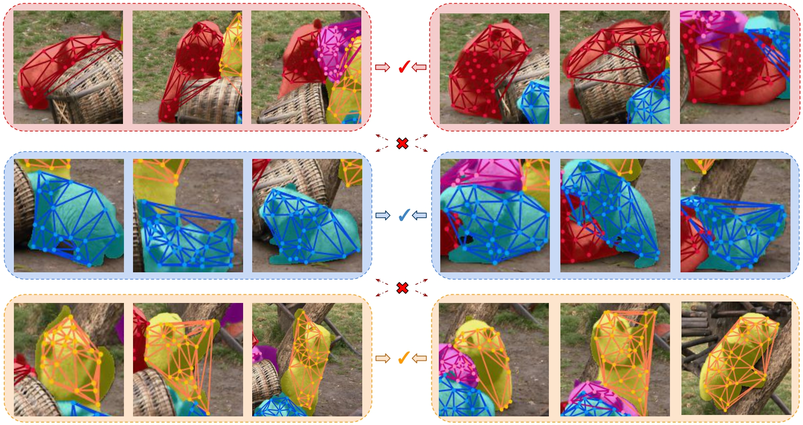

# AirObject: A Temporally Evolving Graph Embedding for Object Identification

[](./LICENSE)
[](https://github.com/Nik-V9/AirObject/stargazers)
[](https://chenwang.site/airseries/)
[](https://arxiv.org/abs/2111.15150)
[](https://cvpr2022.thecvf.com/)

## Introduction

AirObject is a CVPR 2022 research project. In this work, we present AirObject, a temporal class-agnostic object encoding method to obtain global keypoint graph-based embeddings of objects. Specifically, the global 3D object embeddings are generated using a temporal convolutional network across structural information of multiple frames obtained from a graph attention-based encoding method. This repo contains the official code to run AirObject and other Baselines presented in the paper for Video Object Identification. We also provide code for training and global object tracking.

<p align="center">
  
    <br/><em>Matching Temporally Evolving Representations using AirObject</em>
</p>

For more details, please see:

* Full paper PDF: [AirObject: A Temporally Evolving Graph Embedding for Object Identification](https://arxiv.org/abs/2111.15150).

* Authors: *Nikhil Varma Keetha, Chen Wang, Yuheng Qiu, Kuan Xu, Sebastian Scherer*

* Blog: https://theairlab.org/airobject/

<p align="center">
  
</p>

## Dependencies

Simply run the following commands:

```bash
conda create --channel conda-forge --name airobj --file ./AirObject/conda_requirements.txt
conda activate airobj
conda install pytorch==1.8.0 torchvision==0.9.0 torchaudio==0.8.0 cudatoolkit=10.2 -c pytorch
pip install pyyaml opencv-python scipy tqdm pycocotools

cd ./AirObject/cocoapi/PythonAPI
python setup.py build
python setup.py install
```

## Data

For Data Loading, we use dataloaders present in the datasets folder.

Please download train.zip and annotations_train.json from the OVIS Dataset for Inference:

* [Google Drive](https://drive.google.com/drive/folders/1eE4lLKCbv54E866XBVce_ebh3oXYq99b)

## Pre-trained Models for Inference

For inference, please download the models.zip file:

* [Pre-trained Models](https://mega.nz/file/IgBVDQrD#qxdB2hNazSTbV1_QdQwO2AamWveCsBTk3AGieZ8jmDQ)

## SuperPoint Features Extraction

We first start by pre-extracting SuperPoint features for all the images. Please modify the `superpoint_extraction.yaml` config file to extract SuperPoint Features for different datasets:

```sh
python './AirObject/superpoint_extraction.py' -c './AirObject/config/superpoint_extraction.yaml' -g 1
```

## Video Object Identification Evaluation

Please modify the `eval.yaml` config file to test for different methods and datasets.

On the first run, we save the video object dictionary to the `save_dir` to avoid redundant computation. Subsequently, to use the video object dictionary, set `resume` to `True`.

```sh
python './AirObject/eval.py' -c './AirObject/config/eval.yaml' -g 1
```

PR-AUC(%) results on YT-VIS Test Split:

| 2D Baseline | 3D Baseline | NetVLAD | SeqNet | AirObject |
| :---------: | :---------: | :-----: | :----: | :-------: |
|    81.00    |    80.01    |  75.43  |  89.42 |   91.20   |

PR-AUC(%) results on OVIS:

| 2D Baseline | 3D Baseline | NetVLAD | SeqNet | AirObject |
| :---------: | :---------: | :-----: | :----: | :-------: |
|    40.11    |    43.50    |  40.54  |  62.60 |   63.07   |

## Ablation Study: Sequence Length

Please modify the `eval_seq.yaml` config file to test SeqNet & AirObject for different sequence lengths. 

Use the saved video object dictionary obtained from `eval.py`.

```sh
python './AirObject/eval_seq.py' -c './AirObject/config/eval_seq.yaml' -g 1
```

## Global Object Tracking

Expected directory structure for `track.py`:

```bash
Base Directory/
├── image_0
├── semantic
└── sp_0
```

MaskRCNN Inference:

```sh
python './tracking/maskrcnn_inference.py' -c './config/tracking/maskrcnn_inference.yaml' -g 1
```

SuperPoint Inference:

```sh
python './tracking/superpoint_inference.py' -c './config/tracking/superpoint_inference.yaml' -g 1
```

Please modify `track.yaml` to run global object tracking with different methods and parameters.

Global Object Tracking:

```sh
python './tracking/track.py' -c './config/tracking/track.yaml' -g 1
```

## Training

To train Graph Attention Encoder: (Please refer to `train_gcn.yaml`)

```sh
python './train/train_gcn.py' -c './config/train_gcn.yaml' -g 1
```

To train NetVLAD: (Please refer to `train_netvlad.yaml`)

```sh
python './train/train_netvlad.py' -c './config/train_netvlad.yaml' -g 1
```

To train SeqNet: (Please refer to `train_seqnet.yaml`)

```sh
python './train/train_seqnet.py' -c './config/train_seqnet.yaml' -g 1
```

To train AirObject: (Please refer to `train_airobj.yaml`)

```sh
python './train/train_airobj.py' -c './config/train_airobj.yaml' -g 1
```

## BibTeX Citation

If any ideas from the paper or code from this repo are used, please consider citing:

```txt
@inproceedings{keetha2022airobject,
  title     = {AirObject: A Temporally Evolving Graph Embedding for Object Identification},
  author    = {Keetha, Nikhil Varma and Wang, Chen and Qiu, Yuheng and Xu, Kuan and Scherer, Sebastian}, 
  booktitle = {CVPR},
  year      = {2022},
  url       = {https://arxiv.org/abs/2111.15150}}
```

The code is licensed under the [BSD 3-Clause License](./LICENSE).

## Acknowledgements

The authors acknowledge the support from the AirLab and Robotics Institute, Carnegie Mellon University. This work was supported by ONR Grant N0014-19-1-2266 and ARL DCIST CRA award W911NF-17-2-0181.

We would also like to acknowledge the [AirCode](https://github.com/wang-chen/AirCode) and [YT-VOS API](https://github.com/achalddave/ytvosapi) code repos.

## Related works

Please check out the [Air Series Articles](https://chenwang.site/airseries/).